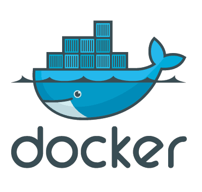

#HSLIDE

### Docker For Developer

#VSLIDE

#VSLIDE

### Luis Mayta

- Software Developer
- Go enthusiast
- Python enthusiast

#VSLIDE

### Contacts:

- [@slovacus](https://twitter.com/slovacus)
- [github.com/luismayta](https://github.com/luismayta)

#HSLIDE

### Agenda

1. what is docker?.
1. Why docker?.
1. History and capabilities.
1. What is container in docker.
1. Why people developer love docker.
1. Finding and downloading images.
1. running.
1. committing and push changes.
1. projects uses docker.

#VSLIDE

### What is docker?.

Docker is an open source engine that automates the
deployment of any application as a lightweight, portable,
self-sufficient container that will run virtually anywhere.

#VSLIDE

### Why docker?

* Lightweight linux container.
* Boots up in seconds.
* Incrementaly build, revert and reuse your container.
* Api to manage things remotely.

#VSLIDE

### History and capabilities

* Written in go .
* `> 1 year`.
* dot Cloud.
* run self-sufficient containers.
* Amazing speed.
* LightWeight

#VSLIDE

### What is container in docker

#VSLIDE

### Why people developer love docker

### Shipping code to server is easy.

#VSLIDE

### Finding and downloading images

    !bash
    docker search ubuntu
    docker pull ubuntu:14.04

#VSLIDE

### Running

    !bash
    docker run ubuntu:14.04 /bin/echo hello world
    docker run -i -t ubuntu:14.04 /bin/bash

#HSLIDE

#### Some Related Links

* [Docker](https://docker.io/)

#HSLIDE

### Gracias

**No hay nada que no puedas hacer, si te lo propones**